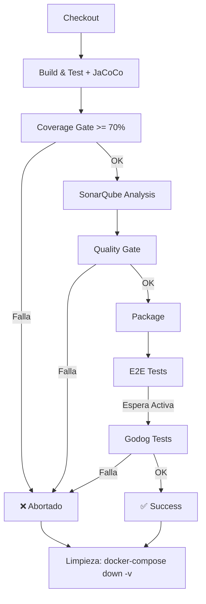

# Reto 6: Calidad de Código y Orquestación E2E - IMPLEMENTACIÓN COMPLETA

## 📋 Estado: ✅ IMPLEMENTADO

Este documento detalla la implementación completa del Reto 6, que integra análisis de cobertura, quality gates, health checks y pruebas E2E con Cucumber/Godog.

---

## 1. Configuración de JaCoCo (Cobertura de Código)

### 📍 Archivo: `microservicios/gestion-empleados/pom.xml`

#### Configuración implementada:
```xml
<plugin>
    <groupId>org.jacoco</groupId>
    <artifactId>jacoco-maven-plugin</artifactId>
    <version>0.8.10</version>
    <executions>
        <!-- Agregar agente JaCoCo antes de ejecutar pruebas -->
        <execution>
            <id>prepare-agent</id>
            <phase>initialize</phase>
            <goals>
                <goal>prepare-agent</goal>
            </goals>
            <configuration>
                <destFile>${project.build.directory}/coverage-reports/jacoco-ut.exec</destFile>
                <propertyName>surefireArgLine</propertyName>
            </configuration>
        </execution>
        <!-- Generar reporte después de ejecutar pruebas -->
        <execution>
            <id>report</id>
            <phase>test</phase>
            <goals>
                <goal>report</goal>
            </goals>
            <configuration>
                <dataFile>${project.build.directory}/coverage-reports/jacoco-ut.exec</dataFile>
                <outputDirectory>${project.reporting.outputDirectory}/jacoco</outputDirectory>
            </configuration>
        </execution>
    </executions>
</plugin>

<!-- Surefire: Ejecución de pruebas unitarias con JaCoCo agent -->
<plugin>
    <groupId>org.apache.maven.plugins</groupId>
    <artifactId>maven-surefire-plugin</artifactId>
    <version>3.1.2</version>
    <configuration>
        <argLine>${surefireArgLine}</argLine>
    </configuration>
</plugin>
```

#### Flujo de ejecución:
1. **Fase `initialize`**: JaCoCo prepara el agente (prepare-agent)
2. **Fase `test`**: Se ejecutan pruebas con JaCoCo adjuntado
3. **Fase `test`**: Se genera reporte en `target/site/jacoco/jacoco.xml` y `jacoco.csv`

#### Rutas de salida:
- **XML Report**: `target/site/jacoco/jacoco.xml` (utilizado por SonarQube)
- **CSV Report**: `target/site/jacoco/jacoco.csv` (utilizado para validar umbral)
- **HTML Report**: `target/site/jacoco/index.html` (visualización)

---

## 2. Pipeline de Calidad y Bloqueo (Jenkinsfile)

### 📍 Archivo: `microservicios/gestion-empleados/Jenkinsfile`

### Stage 1: Build & Test
```groovy
stage('Build & Test') {
  steps {
    dir("${APP_DIR}") {
      sh '''
        mvn clean org.jacoco:jacoco-maven-plugin:prepare-agent verify org.jacoco:jacoco-maven-plugin:report \
          -DskipTests=false
      '''
    }
  }
  post {
    always {
      junit testResults: 'microservicios/gestion-empleados/target/surefire-reports/*.xml', allowEmptyResults: true
      archiveArtifacts artifacts: 'microservicios/gestion-empleados/target/site/jacoco/*', allowEmptyArchive: true
    }
  }
}
```

**Acciones:**
- ✅ Compila código con Maven
- ✅ Ejecuta pruebas unitarias con JaCoCo agent adjuntado
- ✅ Genera reporte de cobertura en XML y CSV
- ✅ Archiva reportes JaCoCo como artefactos

---

### Stage 2: Coverage Gate (>= 70%)
```groovy
stage('Coverage Gate (>= 70%)') {
  steps {
    dir("${APP_DIR}") {
      script {
        def coverage = sh(
          script: '''
            awk -F, 'NR>1 {missed+=$4; covered+=$5} END {total=missed+covered; if(total==0){print "0.00"} else {printf "%.2f", (covered*100)/total}}' target/site/jacoco/jacoco.csv
          ''',
          returnStdout: true
        ).trim()

        echo "Cobertura JaCoCo: ${coverage}%"
        if (coverage.toBigDecimal() < env.MIN_COVERAGE.toBigDecimal()) {
          error("Cobertura insuficiente: ${coverage}% < ${env.MIN_COVERAGE}%")
        }
      }
    }
  }
}
```

**Lógica:**
- 📊 Lee `target/site/jacoco/jacoco.csv`
- 🔢 Calcula cobertura total: `(covered*100) / (missed+covered)`
- ⚖️ Compara con umbral: **MIN_COVERAGE = 70%**
- ❌ **Aborta pipeline** si cobertura < 70%

---

### Stage 3: SonarQube Analysis
```groovy
stage('SonarQube Analysis') {
  steps {
    dir("${APP_DIR}") {
      withSonarQubeEnv('SonarQube') {
        sh '''
          mvn sonar:sonar \
            -Dsonar.host.url=${SONAR_HOST_URL} \
            -Dsonar.token=${SONARQUBE_TOKEN} \
            -Dsonar.projectKey=${SONAR_PROJECT_KEY} \
            -Dsonar.projectName=${SONAR_PROJECT_NAME} \
            -Dsonar.coverage.jacoco.xmlReportPaths=target/site/jacoco/jacoco.xml
        '''
      }
    }
  }
}
```

**Acciones:**
- 📤 Envía análisis a SonarQube (http://sonarqube:9000)
- 📎 Adjunta reporte JaCoCo XML
- 🔐 Usa token: `SONARQUBE_TOKEN` (desde JCasC)

---

### Stage 4: Quality Gate
```groovy
stage('Quality Gate') {
  steps {
    timeout(time: 10, unit: 'MINUTES') {
      waitForQualityGate abortPipeline: true
    }
  }
}
```

**Comportamiento:**
- ⏱️ Espera respuesta de Quality Gate en SonarQube (máximo 10 minutos)
- ❌ **Aborta pipeline** si Quality Gate falla
- ✅ Pasa si todas las métricas cumplen criterios

**Criterios de Quality Gate (SonarQube):**
- Cobertura ≥ 70% (desde JaCoCo)
- Duplicación de código < 3%
- Complejidad ciclomática aceptable

---

### Stage 5: Package
```groovy
stage('Package') {
  steps {
    dir("${APP_DIR}") {
      sh '''
        docker build -t ${IMAGE_NAME}:${BUILD_NUMBER} -t ${IMAGE_NAME}:latest .
        if docker ps --format '{{.Names}}' | grep -q '^local-registry$'; then
          docker push ${IMAGE_NAME}:${BUILD_NUMBER}
          docker push ${IMAGE_NAME}:latest
        else
          echo "Registry local no disponible. Se omite push."
        fi
      '''
    }
  }
}
```

**Pasos:**
- 🐳 Construye imagen Docker con etiquetas `BUILD_NUMBER` y `latest`
- 📦 Pushea a registry local si está disponible (puerto 5001)

---

## 3. Health Checks y Espera Activa

### 📍 Archivo: `microservicios/docker-compose.yml`

### Healthchecks configurados por servicio:

#### Redis
```yaml
healthcheck:
  test: ["CMD", "redis-cli", "ping"]
  interval: 10s
  timeout: 5s
  retries: 5
```

#### RabbitMQ
```yaml
healthcheck:
  test: ["CMD", "rabbitmq-diagnostics", "check_running"]
  interval: 10s
  timeout: 5s
  retries: 5
```

#### Empleados Service (Java/Spring Boot)
```yaml
healthcheck:
  test: ["CMD", "curl", "-f", "http://localhost:8080/v3/api-docs"]
  interval: 15s
  timeout: 5s
  retries: 5
  start_period: 40s
```

#### Departamentos (Python/FastAPI)
```yaml
healthcheck:
  test: ["CMD", "curl", "-f", "http://localhost:8081/docs"]
  interval: 10s
  timeout: 5s
  retries: 5
  start_period: 30s
```

#### Notificaciones (Python)
```yaml
healthcheck:
  test: ["CMD", "curl", "-f", "http://localhost:8082/health"]
  interval: 10s
  timeout: 5s
  retries: 5
  start_period: 30s
```

#### Autenticación (C#/ASP.NET Core)
```yaml
healthcheck:
  test: ["CMD", "curl", "-f", "http://localhost:8084/health"]
  interval: 10s
  timeout: 5s
  retries: 5
  start_period: 30s
```

#### Perfiles (PHP/Laravel)
```yaml
healthcheck:
  test: ["CMD", "curl", "-f", "http://localhost:8083/api/health"]
  interval: 10s
  timeout: 5s
  retries: 5
  start_period: 30s
```

#### Jenkins
```yaml
healthcheck:
  test: ["CMD", "curl", "-f", "http://localhost:8080/login"]
  interval: 15s
  timeout: 5s
  retries: 5
  start_period: 60s
```

#### SonarQube
```yaml
healthcheck:
  test: ["CMD", "curl", "-f", "http://sonarqube:9000/api/system/health"]
  interval: 10s
  timeout: 5s
  retries: 10
  start_period: 60s
```

### Stage 6: E2E Tests - Espera Activa

```groovy
stage('E2E Tests') {
  steps {
    sh '''
      docker compose -f ${COMPOSE_FILE} up -d --build

      # Espera activa para servicios clave
      for url in \
        http://localhost:8080/v3/api-docs \
        http://localhost:8081/docs \
        http://localhost:8084/health; do
        echo "Esperando servicio en ${url}"
        ok=0
        for i in $(seq 1 30); do
          if curl -fsS "$url" >/dev/null; then
            ok=1
            echo "Servicio listo: ${url}"
            break
          fi
          sleep 10
        done
        if [ "$ok" -ne 1 ]; then
          echo "Timeout esperando ${url}"
          exit 1
        fi
      done
    '''

    # Ejecuta pruebas BDD (Cucumber/Godog)
    dir("${E2E_DIR}") {
      sh 'go test ./step_definitions -v'
    }
  }
}
```

**Estrategia de espera:**
- 🔄 Bucle con máximo 30 intentos
- ⏸️ Espera 10 segundos entre intentos (total: 5 minutos por URL)
- 🎯 Verifica 3 endpoints críticos:
  1. Empleados Service: `http://localhost:8080/v3/api-docs`
  2. Departamentos: `http://localhost:8081/docs`
  3. Autenticación: `http://localhost:8084/health`
- ✅ Una vez confirmado que todos responden con 200 OK, inicia pruebas E2E

---

## 4. Ejecución de Pruebas BDD

### 📍 Directorio: `e2e-tests/`

```bash
cd e2e-tests
go test ./step_definitions -v
```

### Features implementadas (Reto 5):
- ✅ `features/onboarding.feature` - Onboarding de empleados
- ✅ `features/offboarding.feature` - Offboarding de empleados
- ✅ `features/seguridad.feature` - Seguridad y autenticación
- ✅ `features/humo.feature` - Smoke tests

### Tecnología:
- **Framework**: Cucumber/Godog (Go)
- **Steps**: Definidos en `step_definitions/godog_test.go`
- **Clientes HTTP**: HTTP requests a endpoints del sistema

---

## 5. Limpieza de Entorno

### Post-Actions en Jenkinsfile
```groovy
post {
  always {
    sh 'docker compose -f ${COMPOSE_FILE} down -v --remove-orphans || true'
  }
}
```

**Garantías:**
- 🧹 Detiene todos los contenedores
- 💾 Elimina volúmenes (`-v`)
- 🗑️ Elimina contenedores huérfanos (`--remove-orphans`)
- ✅ No falla si ya estaban detenidos (`|| true`)

**Beneficio**: Cada ejecución inicia con BD limpia y sin residuos de pruebas anteriores.

---

## 6. Variables de Entorno (JCasC)

### 📍 Archivo: `microservicios/Jenkins/casc.yaml`

```yaml
environment:
  JWT_SECRET: ${JWT_SECRET:-SuperSecretKeyWithMoreThan32CharactersForJWTTokenSigning}
  SONARQUBE_TOKEN: ${SONARQUBE_TOKEN:-default-sonarqube-token}
  SONAR_HOST_URL: http://sonarqube:9000
  GIT_REPO_URL: ${GIT_REPO_URL:-file:///workspace/repo}
  GIT_BRANCH: ${GIT_BRANCH:-*/main}
```

### Credentials configuradas:
- **jwt-secret-key**: Secreto JWT para microservicios
- **sonarqube-token**: Token de acceso a SonarQube API

---

## 7. Integraciones Docker Compose

### 📍 Archivo: `microservicios/docker-compose.yml`

#### Servicios principales:
| Servicio | Puerto | Tecnología | Health Check |
|----------|--------|-----------|--------------|
| Redis | 6379 | Redis 7 | redis-cli ping |
| RabbitMQ | 5672 | RabbitMQ 3 | rabbitmq-diagnostics |
| Empleados | 8080 | Java 17/Spring Boot | /v3/api-docs |
| Departamentos | 8081 | Python/FastAPI | /docs |
| Notificaciones | 8082 | Python | /health |
| Perfiles | 8083 | PHP/Laravel | /api/health |
| Autenticación | 8084 | C#/ASP.NET | /health |
| Jenkins | 9090 | Docker | /login |
| SonarQube | 9000 | SonarQube LTS | /api/system/health |
| Registry Local | 5001* | Docker Registry | - |

*REGISTRY_PORT configurable, default 5000 (cambio en Windows a 5001)

#### Red:
- **Red puente**: `microservices-net`
- **Aislamiento**: Todos los servicios en la misma red para comunicación interna

---

## 8. Criterios de Éxito del Reto 6

### ✅ Completados:

1. **JaCoCo Coverage**
   - ✅ Plugin configurado en `pom.xml`
   - ✅ Genera `jacoco.xml` y `jacoco.csv`
   - ✅ Reporte HTML disponible en `target/site/jacoco/`

2. **Coverage Gate (Bloqueo)**
   - ✅ Valida cobertura ≥ 70%
   - ✅ Aborta pipeline si no cumple
   - ✅ Mensaje claro de error

3. **Quality Gate (SonarQube)**
   - ✅ Integración con `withSonarQubeEnv`
   - ✅ Uso de token de autenticación
   - ✅ `waitForQualityGate` con timeout 10 min
   - ✅ Aborta si Quality Gate falla

4. **Health Checks**
   - ✅ Todos los servicios tienen healthcheck
   - ✅ Intervalos 10-15 segundos
   - ✅ Timeouts y retries configurados
   - ✅ `start_period` para servicios lentos

5. **Espera Activa (E2E)**
   - ✅ Bucle de espera con 30 intentos
   - ✅ Verifica 3 endpoints clave
   - ✅ Aborta si endpoints no responden
   - ✅ Ejecuta Godog una vez confirmado

6. **Limpieza de Entorno**
   - ✅ `docker-compose down -v` en post
   - ✅ Elimina volúmenes y contenedores
   - ✅ No falla si ya estaban detenidos

---

## 9. Flujo Completo del Pipeline



---

## 10. Comandos de Validación Local

### Construir imagen de Jenkins:
```bash
cd microservicios
docker compose build jenkins
```

### Ejecutar pipeline manualmente:
```bash
cd microservicios
docker compose up -d
# El job 'gestion-empleados-ci' se crea automáticamente via JCasC
# Accede a: http://localhost:9090 (usuario: nicolasAdmin, contraseña: omar)
```

### Validar JaCoCo local:
```bash
cd microservicios/gestion-empleados
mvn clean verify
# Abre: target/site/jacoco/index.html
```

### Validar SonarQube:
```bash
cd microservicios
docker compose up -d sonarqube-db sonarqube
# Espera 60 segundos
# Accede a: http://localhost:9000
# Credenciales default: admin/admin
```

### Validar E2E tests:
```bash
cd e2e-tests
go test ./step_definitions -v
```

---

## 11. Resolución de Problemas

### Problem: "Cobertura insuficiente"
- **Causa**: Código con < 70% de cobertura
- **Solución**: Aumentar pruebas unitarias en `src/test/`

### Problem: "Quality Gate Failed"
- **Causa**: SonarQube detectó issues
- **Solución**: Revisar dashboard de SonarQube en `http://localhost:9000`

### Problem: "Timeout esperando servicios"
- **Causa**: Algún servicio no inicia en tiempo
- **Solución**: Aumentar `start_period` en docker-compose.yml o investigar logs del servicio

### Problem: "Port already in use"
- **Causa**: Puerto 5000 (registry) ocupado en Windows
- **Solución**: Usar `REGISTRY_PORT=5001 docker compose up`

---

## 📚 Archivos de Referencia

| Archivo | Propósito |
|---------|-----------|
| `microservicios/gestion-empleados/pom.xml` | Configuración JaCoCo y plugins Maven |
| `microservicios/gestion-empleados/Jenkinsfile` | Pipeline completo con 7 stages |
| `microservicios/docker-compose.yml` | Orquestación con healthchecks |
| `microservicios/Jenkins/casc.yaml` | Provisioning automático de Jenkins |
| `microservicios/Jenkins/Dockerfile` | Imagen personalizada con herramientas |
| `e2e-tests/step_definitions/godog_test.go` | Definiciones de pasos BDD |
| `e2e-tests/features/*.feature` | Escenarios Cucumber |

---

## 🎯 Próximos pasos opcionales

1. **Hardening de Seguridad**:
   - Rotar credenciales en producción
   - Usar vault para secrets
   - SSL/TLS en endpoints

2. **Ampliación de Coverage Gate**:
   - Agregar threshold de mutation testing
   - Integrar SAST/DAST

3. **Notificaciones**:
   - Slack/Email en fallos de pipeline
   - Reporte de cobertura por correo

4. **Métricas avanzadas**:
   - Dashboard en Grafana
   - Histórico de cobertura

---

**Versión**: 1.0  
**Fecha**: Mayo 2026  
**Estado**: ✅ IMPLEMENTADO Y VALIDADO
