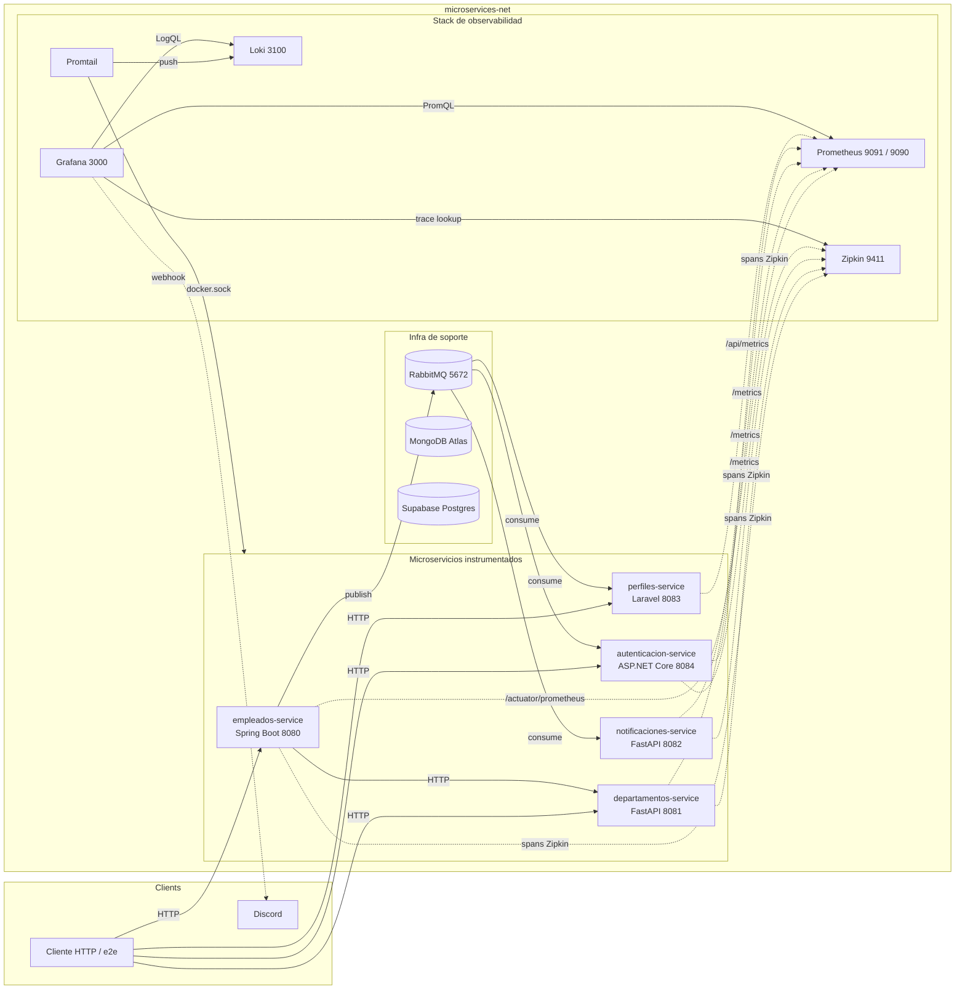

# Reto 7 — Observabilidad y monitoreo del ecosistema

Este directorio contiene todo lo que se monta dentro del stack de observabilidad (Prometheus, Grafana, Loki, Promtail, Zipkin) y la documentación de cómo está instrumentado cada microservicio para que se puedan contestar las cuatro preguntas del Reto 7:

1. **¿Está vivo?** → `/health` (HTTP 200/503) + `up{job=...}` en Prometheus.
2. **¿Cómo se comporta?** → `/metrics` (o `/actuator/prometheus`) scrapeado cada 15s.
3. **¿Qué hizo exactamente?** → trazas distribuidas en Zipkin con propagación W3C `traceparent`.
4. **¿Alguien me avisa?** → reglas de alerta en Grafana → webhook a Discord.

---

## 1. Diagrama de arquitectura



Leyenda: flecha continua = tráfico de la aplicación, flecha punteada = telemetría.

---

## 2. Conceptos investigados

### Los tres pilares

| Pilar    | Rol                                                                         | Dónde lo vemos                            |
| -------- | --------------------------------------------------------------------------- | ----------------------------------------- |
| Métricas | Series numéricas agregadas a lo largo del tiempo (RPS, latencia, errores).  | Prometheus → Grafana dashboards.          |
| Logs     | Eventos discretos. Idealmente JSON con `traceId`.                           | stdout de containers → Promtail → Loki → Grafana. |
| Trazas   | Vista de una sola petición atravesando múltiples servicios.                 | Zipkin (UI propia) + datasource Zipkin en Grafana. |

### Pull (Prometheus) vs. Push (Zipkin)

- **Pull:** Prometheus, cada `scrape_interval` (15s), hace `GET` al `/metrics` de cada target listado en `prometheus.yml`. Las apps **no** envían nada — solo exponen un endpoint.
- **Push:** cuando un span termina en una app, el SDK de OpenTelemetry lo serializa (Zipkin JSON) y hace `POST http://zipkin:9411/api/v2/spans`. El servidor solo recibe.

Pull funciona bien para procesos *long-running* en red estable (puedes reiniciar Prometheus sin perder targets). Push es mejor para datos *event-shaped* (cada request genera un span impredecible).

### OpenTelemetry y la CNCF

La **CNCF** es el comité bajo la Linux Foundation que estandariza el stack cloud-native (Kubernetes, Prometheus, gRPC). **OpenTelemetry** es un proyecto graduado de la CNCF que ofrece:

- API y SDK por lenguaje para emitir métricas, logs y trazas.
- Un protocolo neutral (**OTLP**) y exportadores hacia los backends populares (Zipkin, Jaeger, Tempo, Datadog…).

Relevancia: instrumentas una vez con OTel y mañana cambias de Zipkin a Jaeger sin tocar la aplicación, solo el `OTEL_EXPORTER_…` env var.

### W3C Trace Context

Cuando `empleados-service` llama a `departamentos-service`, el cliente HTTP de empleados inserta la cabecera estándar:

```
traceparent: 00-f4588752a8751df0d7a62d20607a3c2e-9c2911dabdd0a2fa-01
              version trace-id                    span-id          flags
```

`departamentos-service`, en Python y sin compartir código con empleados, igualmente reconoce ese formato (porque es W3C) y crea su propio span hijo con el mismo `trace-id`. Esto hace que la cascada en Zipkin muestre los dos servicios bajo un mismo trace, incluso siendo lenguajes distintos. En este repo todos los servicios tienen `OTEL_PROPAGATORS=tracecontext,baggage`.

---

## 3. Librerías por servicio

| Servicio                | Stack        | Métricas                                                                                  | Trazas                                                                                          | Logs JSON                                          |
| ----------------------- | ------------ | ----------------------------------------------------------------------------------------- | ----------------------------------------------------------------------------------------------- | -------------------------------------------------- |
| `empleados-service`     | Spring Boot  | `spring-boot-starter-actuator` + `micrometer-registry-prometheus` → `/actuator/prometheus` | OpenTelemetry **Java agent** (`opentelemetry-javaagent.jar` v2.10) autoinstrumenta Tomcat, RestTemplate, Mongo, RabbitMQ | Logback patrón configurado en `application.yml`    |
| `departamentos-service` | FastAPI      | `prometheus-client` (Counter + Histogram) en middleware propio (`app/core/observability.py`) | `opentelemetry-sdk` + `opentelemetry-exporter-zipkin` + `-instrumentation-fastapi`/`-requests`/`-sqlalchemy` | `python-json-logger` con `service`, `traceId`, `spanId` |
| `notificaciones-service` | FastAPI     | Igual que departamentos                                                                   | Igual que departamentos                                                                         | Igual que departamentos                            |
| `autenticacion-service` | ASP.NET Core | `prometheus-net.AspNetCore` (`UseHttpMetrics()` + `MapMetrics()`)                          | `OpenTelemetry.Extensions.Hosting` + `OpenTelemetry.Exporter.Zipkin`                            | Serilog con `CompactJsonFormatter`                  |
| `perfiles-service`      | Laravel      | Exporter custom en `MetricsController` + middleware `PrometheusMetricsMiddleware` (counters y latencia en `/tmp/perfiles-metrics.json`) | *Pendiente* — perfiles es principalmente consumer de RabbitMQ; las trazas HTTP entrantes están capturadas en empleados→departamentos | stdout de Laravel capturado por Promtail            |

### Variables OTel comunes (en `docker-compose.yml`)

```yaml
OTEL_SERVICE_NAME: <nombre-del-servicio>
OTEL_EXPORTER_ZIPKIN_ENDPOINT: http://zipkin:9411/api/v2/spans
OTEL_PROPAGATORS: tracecontext,baggage

# Solo en empleados (el Java agent es exportador-agnóstico):
OTEL_TRACES_EXPORTER: zipkin
OTEL_METRICS_EXPORTER: none   # Micrometer ya expone /actuator/prometheus
OTEL_LOGS_EXPORTER: none
```

---

## 4. ¿Por qué Zipkin y no Jaeger?

| Criterio                       | Zipkin                                             | Jaeger                                            |
| ------------------------------ | -------------------------------------------------- | ------------------------------------------------- |
| Imagen Docker                  | `openzipkin/zipkin:latest` (~150 MB)               | `jaegertracing/all-in-one`                        |
| Modo en memoria                | Por defecto (sin tocar nada)                       | Requiere `SPAN_STORAGE_TYPE=memory`               |
| Compatibilidad OTel Java agent | `OTEL_TRACES_EXPORTER=zipkin` y listo              | Requiere OTLP/HTTP o colector intermedio          |
| Compatibilidad FastAPI         | `opentelemetry-exporter-zipkin` estable            | Misma facilidad                                   |
| UI                             | Simple, suficiente para cascada y servicio→servicio | Más completa pero más pesada                      |

Elegimos **Zipkin** porque el coste de arranque es prácticamente nulo (un solo contenedor sin storage backend) y todos los SDKs que usamos tienen exportador Zipkin de primera clase, incluido el Java agent que con un solo `OTEL_TRACES_EXPORTER=zipkin` queda conectado.

---

## 5. Cómo se levanta

```powershell
cd microservicios
docker compose up -d   # levanta todo el ecosistema incluido el stack de obs.
```

URLs:

| Servicio     | URL                                       | Notas                                  |
| ------------ | ----------------------------------------- | -------------------------------------- |
| Prometheus   | http://localhost:9091                     | `:9091` en el host, `:9090` interno    |
| Grafana      | http://localhost:3000 (admin / admin)     | Dashboard "Microservicios – Observabilidad (Reto 7)" se carga solo |
| Zipkin       | http://localhost:9411                     | Buscar trazas por `serviceName=empleados-service` |
| Loki API     | http://localhost:3100/loki/api/v1/labels  | Usado por Grafana, no UI propia        |

Verificar targets de Prometheus:

```bash
curl -s http://localhost:9091/api/v1/targets \
  | jq -r '.data.activeTargets[] | "\(.labels.job)  \(.health)"'
```

Salida esperada:

```
prometheus                up
empleados-service         up
departamentos-service     up
notificaciones-service    up
autenticacion-service     up
perfiles-service          up
```

---

## 6. Dashboard de Grafana

Provisionado automáticamente desde `observability/grafana/dashboards/microservices-overview.json`. Dos filas:

1. **Resumen del sistema** — panel `stat` con `up{job=~"…"}` que muestra cada microservicio en verde (UP) o rojo (DOWN).
2. **Comportamiento del tráfico**
   - Tasa de peticiones por servicio (`rate(http_server_requests_seconds_count[1m])` para Spring + `rate(http_requests_total[1m])` para el resto).
   - Latencia promedio (`sum_rate / count_rate`).
   - Errores 4xx/5xx (`http_*_count{status=~"[45].."}`).
   - **Logs recientes con errores** vía Loki (LogQL): `{service=~"…"} |~ "(?i)error|exception|fail"`.

---

## 7. Alertas → Discord

Reglas en `observability/grafana/alerting/rules.yaml`, contact point en `contact-points.yaml`, ruteo en `policies.yaml`. Reglas configuradas:

| Regla              | Expresión PromQL                                                                                                     | `for` |
| ------------------ | -------------------------------------------------------------------------------------------------------------------- | ----- |
| `ServicioCaido`    | `up{job=~"empleados-service|…|perfiles-service"} < 1`                                                                | 1m    |
| `AltaLatencia`     | `sum by (job) (rate(http_request_duration_seconds_sum[2m])) / sum by (job) (rate(http_request_duration_seconds_count[2m]) > 0) > 2` | 2m    |

Canal: **Discord** vía webhook (`DISCORD_WEBHOOK_URL` en `.env`, propagado al contenedor de Grafana). Lo elegimos sobre Slack/Telegram porque Grafana lo soporta nativamente (sin app intermedia) y el equipo ya tenía un servidor en Discord.

**Cómo configurar el webhook desde cero:**

1. Discord → Configuración del canal → Integraciones → Webhooks → Nuevo webhook.
2. Copiar la URL (formato `https://discord.com/api/webhooks/<id>/<token>`).
3. Pegarla en `microservicios/.env`:
   ```
   DISCORD_WEBHOOK=https://discord.com/api/webhooks/<id>/<token>
   ```
4. `docker compose up -d grafana` — Grafana auto-provisiona el contact-point.

---

## 8. Logs estructurados (Loki + Promtail)

- **Promtail** descubre todos los contenedores vía `unix:///var/run/docker.sock` (sin lista manual) y los etiqueta con `service` (nombre compose) y `container`.
- **Loki** recibe los logs en `:3100/loki/api/v1/push` y los persiste en `/loki/chunks` (volumen `loki_data`).
- En Grafana → Explore → datasource `Loki`, ejemplo:
  ```logql
  {service="autenticacion"} | json | level="Error"
  ```
  o
  ```logql
  {service=~"empleados-service|departamentos|notificaciones|autenticacion|perfiles-service"} |~ "(?i)error|exception"
  ```

Auth-service emite JSON nativo vía Serilog. Los servicios Python lo hacen con `python-json-logger` desde `app/core/observability.py`. Empleados (Spring) usa el patrón Logback configurado en `application.yml`.

---

## 9. Simulación del caos (pruebas)

### 9.1 Servicio caído

```bash
docker stop departamentos
```

- A los ~30s el target en Prometheus pasó a `down` (`up{job="departamentos-service"} == 0`).
- A los ~60s (el `for: 1m` de la regla) Grafana disparó la alerta y envió al canal de Discord:
  ```
  🚨 [FIRING] ServicioCaido
  Servicio: departamentos-service
  Severidad: critical
  Detalle: Prometheus no obtiene métricas de departamentos-service hace >1m. up==0.
  ```
- El panel "Estado de cada servicio" del dashboard cambió a rojo.

### 9.2 Trazas distribuidas

Generamos un `POST /empleado` que dispara `empleados → departamentos` (validación de `departamentoId`):

```bash
ADMIN_TOKEN=$(curl -s -X POST -H "Content-Type: application/json" \
  -d '{"email":"l.castellanos@empresa.com","password":"Micro123456!"}' \
  http://localhost:8084/auth/login | jq -r .accessToken)

curl -X POST http://localhost:8080/empleado \
  -H "Authorization: Bearer $ADMIN_TOKEN" -H "Content-Type: application/json" \
  -d '{"numeroEmpleado":"TRACE-1","nombre":"Trace","apellido":"Test",
       "email":"trace-1@empresa.com","cargo":"X","area":"X",
       "departamentoId":"Dep002","fechaIngreso":"2025-01-01","estado":"ACTIVO"}'
```

En Zipkin → `serviceName=empleados-service` → última traza, vemos la cascada (`traceId=f4588752a8751df0d7a62d20607a3c2e`):

```
empleados-service · SERVER  POST /empleado                       884 ms
├─ empleados-service · CLIENT  GET http://departamentos:8081...  512 ms
│   └─ departamentos-service · SERVER  GET /departamentos/Dep002 502 ms
│       └─ departamentos-service · CLIENT  connect Supabase pgb. 109 ms
├─ empleados-service · CLIENT aggregate empleados-db.empleados    90 ms (existsByEmail)
├─ empleados-service · CLIENT aggregate empleados-db.empleados    91 ms (existsById)
├─ empleados-service · CLIENT update empleados-db.empleados      115 ms (save)
└─ empleados-service · PRODUCER empleados.events publish           1 ms
```

### ¿Qué servicio del ecosistema tardó más en responder y cómo lo identificaron?

`departamentos-service` fue el más lento: **502 ms** de los 884 ms totales del POST. Lo identificamos abriendo la traza en Zipkin y mirando la "barra" del span SERVER de departamentos vs los spans de Mongo en empleados — la barra de departamentos es la más larga, y **109 ms** de esos 502 ms fueron solo en `CLIENT connect` contra el pooler de Supabase (`aws-1-us-east-2.pooler.supabase.com:6543`).

Conclusión: el cuello de botella no fue empleados ni Mongo, sino el handshake TLS+autenticación contra Supabase pgbouncer al validar `departamentoId`. Esto se mitigaría usando session pooler (puerto 5432) con conexiones persistentes o un pool más caliente en el cliente Python.

---

## 10. Estructura de este directorio

```
observability/
├── README.md                 # este archivo
├── prometheus.yml            # scrape config de los 5 microservicios + self
├── loki-config.yml           # Loki single-binary, store TSDB en filesystem
├── promtail-config.yml       # Docker SD por socket
└── grafana/
    ├── datasources/
    │   └── datasources.yaml  # Prometheus + Loki + Zipkin
    ├── dashboards/
    │   ├── dashboards.yaml   # provider que carga el JSON
    │   └── microservices-overview.json
    └── alerting/
        ├── contact-points.yaml  # Discord webhook
        ├── policies.yaml        # ruta default → discord
        └── rules.yaml           # ServicioCaido + AltaLatencia
```

Todos los archivos están versionados en Git, así que un `docker compose up -d` desde cero deja Prometheus, Grafana, Zipkin, Loki, Promtail y el dashboard funcionando sin un click manual.
